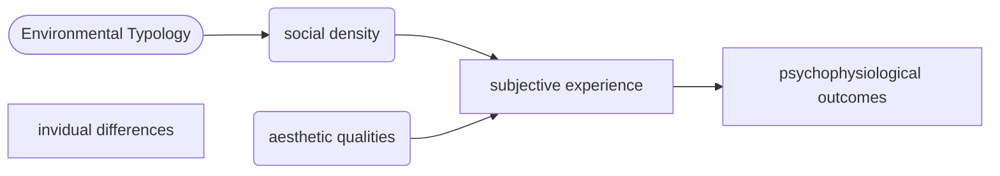

# nice_online_study
This repo contains the code for the online study we are conducting as part of the NICE project, including the experiment code, the analysis and the write-up. The repo will go public once the project is submitted for publication.

